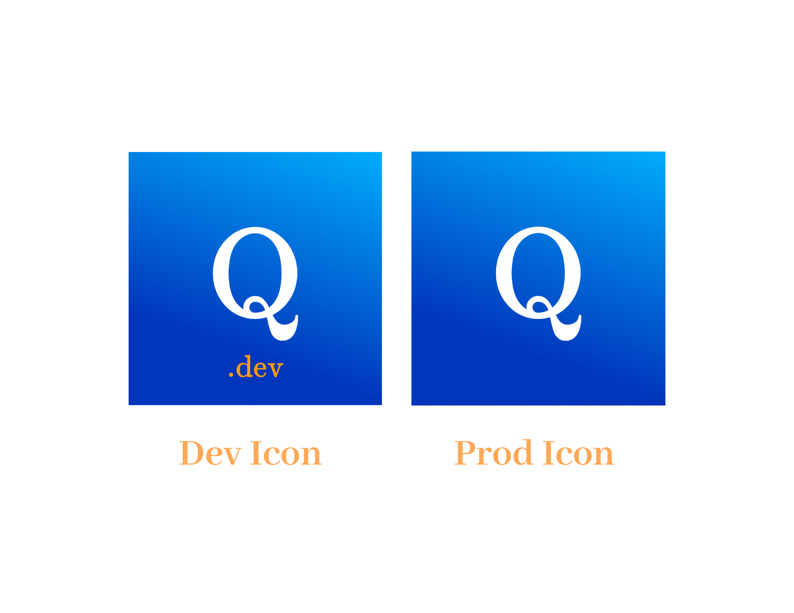
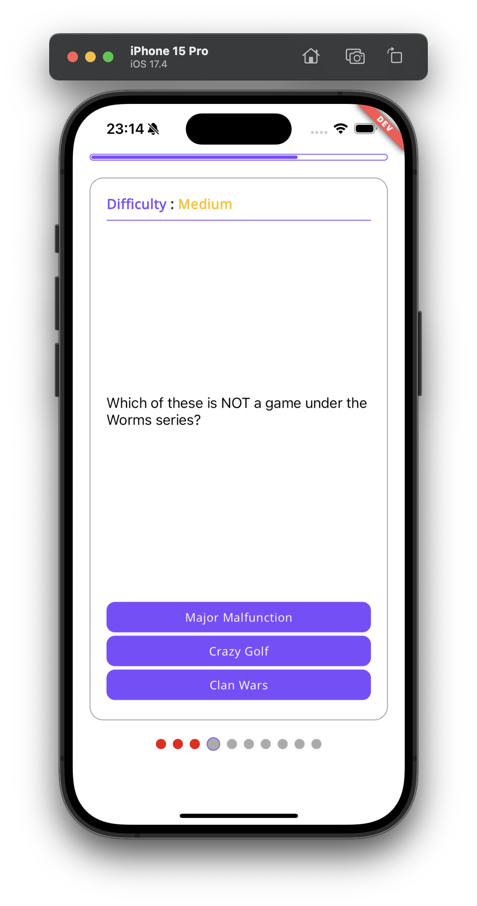
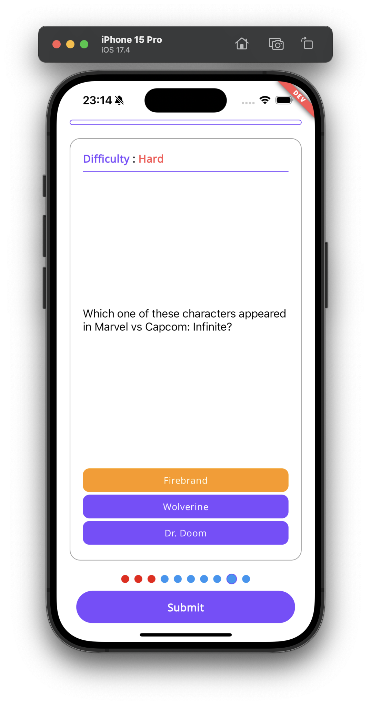
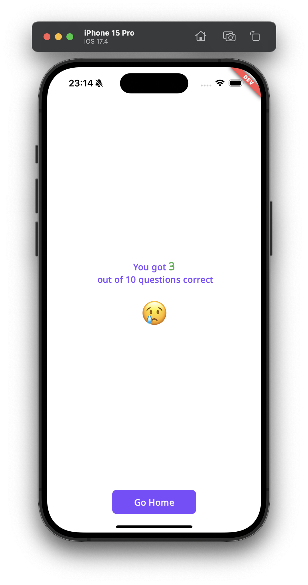

# quizator

Flutter quiz application with automatic index handling. The application automatically changes the question that appears according to the direction in the document.

## Notes and Explanation

- Application uses bloc and hooks for state management. Bloc is used for global state management and hooks is used for minor state changes.
- go_router is used for routing. go_router_builder is used for building routes.
- <https://opentdb.com/api.php?amount=10> API sometimes can return empty list because of that there is also dummy quiz options.
- Quiz category list scrolls horizontally with parallax effect at home view.
- get_it uses for dependency injection.
- chopper and its generator is used for API request.


 <br />

## Screens

- **Splash View:** Splash screen for application.
- **Home View:** Home View to display quiz categories
- **Quiz View:** Quiz View to solve test
- **Score View:** Score View to display user score

 <br />

## Flavors



Quizator uses flavors for different environments. (Development, Production)

**Development:** Development environment for testing and debugging.

**Production:** Production environment for production.

## Demo

#### Home View


#### Quiz View



#### Quiz View



#### Score View



#### Home View Demo


#### Quiz View Demo


#### Submit View


## Features

- Quiz Categories with Parallax Effect
- Test Quiz with Automatically Index Handler

<br />

## Used Packages and Versions

**Packages:**  get_it, flutter_bloc, bloc, flutter_hooks, http, chopper, internet_connection_checker_plus, freezed_annotation, json_annotation, cached_network_image, go_router, talker_flutter, intl, collection, equatable, fpdart

**Flutter Version:** 3.22.0

<br />

## Logs and Crashs

- Application uses talker_flutter and talker_bloc_logger for logging.


<br />

## Tests

- Bloc tests
- Widget tests
- Unit tests

<br />

## Used API Calls

#### Get questions

```http
  GET https://opentdb.com/api.php?amount=10
```

<br />

## Run

Application uses fvm for flutter version management. You can install fvm with this command.

```bash
  dart pub global activate fvm
```

Then you can use flutter version with this command.

```bash
  fvm use 3.22.0
```

Then you must generate files with this command.

```bash
  # for build
  flutter pub run build_runner build --delete-conflicting-outputs

  # for watch
  flutter pub run build_runner watch --delete-conflicting-outputs
```

Then you can run the application with this command.

```bash
# development flavor
  flutter run -t lib/main_development.dart --flavor development

# production flavor
  flutter run -t lib/main_production.dart --flavor production
```

<br />

### If you are using vscode

.vscode/launch.json is created for development, staging, and production flavors. You can run the application with vscode.
